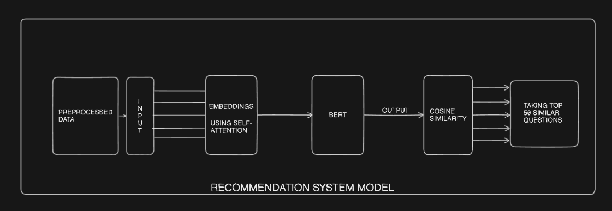

# ML_DSA_Recommendation_project

This Repository consists of our team Leechers's Machine Learning Project

## Table of Contents
- [Setup](#setup)
- [Application Flow](#flow)
  - [A. See Similar Questions](#a-see-similar-questions)
  - [B. Search Questions](#b-search-questions)
- [Data Pipeline](#data-collection-and-preprocessing-pipeline)
- [Recommendation System](#cosine-similarity-based-recommendation-system)
- [Model Architecture](#recommendation-model-architecture)

# Set-up
### Frontend
Start the frontend server by running the following commands front the root directory
```shell
cd ./website/frontend
npm install
npm run dev
```

### Backend
We need to start the backend server from the 'backend' directory present in the 'website' folder. Run the following commands from the root directory :-
```shell
cd website/backend
npm install
npm run dev
```

### Executing model files
- Ensure that you have python installed. Set-up a python virtual environment using the below commands:
```shell
python -m venv myvenv
source myvenv/bin/activate
pip install -r requirements.txt
cd website/model-python
python run.py
```


# *Flow*

---
## A. See Similar Questions
## *Frontend*
1. *Trigger Event*
   - When a user clicks on a specific question, the *See Similar* feature is activated.
   - The system retrieves the question's unique identifier (qId).

2. *API Request to Backend (3000)*
   - The frontend sends a *GET* request to the following endpoint:
     http
     GET `http://localhost:3000/api/questions/similar/{qId}`
     
   - Here, {qId} is the ID of the selected question.

---

## *Backend (API 3000)*
1. *Database Search*
   - The backend searches the database to find the question corresponding to the provided qId.

2. *API Request to Python Model (5000)*
   - A *POST* request is made to the following endpoint:
     http
     POST `http://localhost:5000/api/data`
     
   - The request body contains the *exact name* of the question:
     ```json
     {
       "questionName": "Exact Question Name"
     }
     ```
     

---

## *Python Model (API 5000)*
1. *Processing*
   - The Python model processes the question name received in the request.
   - It computes and identifies *5 similar questions* based on the input.

2. *Response*
   - The model returns the list of 5 similar questions in the response body:
     ```json
     {
       "similarQuestions": [
         "Similar Question 1",
         "Similar Question 2",
         "Similar Question 3",
         "Similar Question 4",
         "Similar Question 5"
       ]
     }
     ```
     

---

## *Frontend*
1. *Display Results*
   - The frontend receives the response from API 3000.
   - The list of similar questions is displayed dynamically on the webpage.

---

## B. Search Questions
---

## *Search Flow*
1. *Frontend: Trigger Search*
   - The frontend provides a search option for users to look up questions.
   - When a search string is entered, a *GET* request is sent to the backend:  
     http
     GET `http://localhost:3000/api/questions/search?q=${search}`
     
     - Here, ${search} is the search query string entered by the user.

2. *Backend (API 3000)*
   - The backend receives the search query and sends a *POST* request to the Flask server on port 5000:
     http
     POST `http://localhost:5000/api/embed_data`
     
     - The request contains the search string for processing.

3. *Flask Server (API 5000)*
   - The Flask server loads the model and searches for questions related to the input string.
   - It identifies and returns the *50 most similar questions* in the response:
     ```json
     {
       "similarQuestions": [
         "Question 1",
         "Question 2",
         "...",
         "Question 50"
       ]
     }
     ```
     

4. *Frontend: Render Results*
   - The frontend receives the response from the backend.
   - The 50 most similar questions are dynamically displayed to the user on the webpage.

---


## Data Collection and Preprocessing Pipeline

### Data Collection

Data is gathered from popular coding platforms such as LeetCode, Codeforces, CodeChef, and AtCoder through web scraping.

### Data Accumulation

The collected data is stored in a structured format, typically as a JSON file, to maintain consistency across platforms and allow easy processing.

### Initial Preprocessing

- Remove irrelevant content, such as HTML tags and unnecessary metadata.
- Filter out unwanted elements like broken characters or unrelated content to retain only useful question details.

### Further Data Enhancement

- Add prefixes for specific features, such as `A` in front of the acceptance rate and `C` in front of the comment count.
- Discard irrelevant features like IDs and external links to maintain a clean dataset.
- Aggregate all relevant features (e.g., question name, topic, difficulty) into a unified format.

### Final Preprocessing

- Standardize text fields, normalize numerical data, and apply tokenization where needed to create vectors for each question.


# Cosine Similarity-Based Recommendation System

This system provides a simple, efficient recommendation engine that uses cosine similarity to suggest questions based on various features, such as question name, text, topic, difficulty, acceptance rate, and comments. By calculating the cosine of the angle between these feature vectors, the system identifies similarities, making it easier to find relevant recommendations.

## Features

- **Cosine Similarity Calculation**: Measures similarity between questions based on multiple attributes.
- **Recommendation Engine**: Recommends questions with high similarity scores, allowing for more tailored question suggestions.


# Recommendation Model Architecture



## Description

This recommendation system model utilizes BERT and self-attention embeddings to generate relevant recommendations based on the input data. The key steps are:

1. **Preprocessing the data**: Initial data is cleaned and formatted for the model. Taking the necessary features which will help for predicting the recommended questions.
2. **Generating embeddings**: The data is transformed into embeddings using self-attention mechanisms.
3. **Passing the embeddings through BERT**: The embeddings are processed by a BERT model to generate representations.
4. **Evaluating the output for cosine similarity**: The BERT model's output is evaluated by calculating cosine similarity between the input and the generated recommendations.
5. **Selecting the top 50 most similar recommendations**: The recommendations are sorted based on their similarity score, and the top 50 are selected.

The model aims to provide relevant and accurate recommendations by leveraging the power of BERT and cosine similarity analysis.

# References

- [Cosine Similarity](https://ieeexplore.ieee.org/document/7577578)

- [Survey paper of word embedding](https://ieeexplore.ieee.org/document/9390956)

- [Impact of word embedding in deep learning environment](https://link.springer.com/article/10.1007/s10462-023-10419-1)
